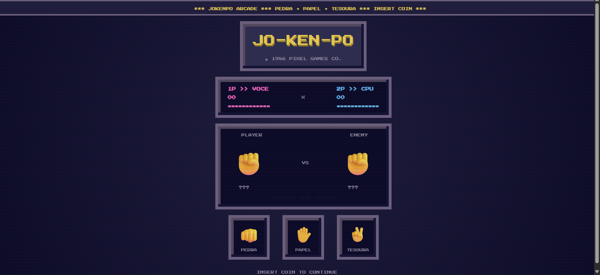
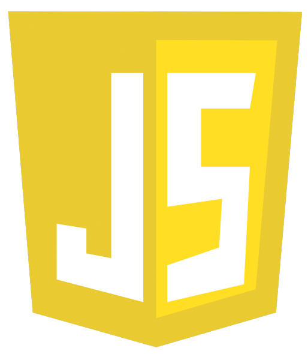

# Jokenpô

####  Um jogo de Pedra, Papel e Tesoura desenvolvido com HTML, CSS e JavaScript puro.

 
Acesse por <a href='http://giuliacastaneda.jokenpo/' target='_blank'>aqui.</a>
 

###  Funcionalidades
- Escolha entre Pedra, Papel ou Tesoura
- Jogada aleatória do computador
- Contagem regressiva antes do resultado
- Animação das mãos
- Placar persistente durante a partida
- Botão "Jogar novamente"
- Botão para zerar o placar
- Interface responsiva

### Tecnologias
-  HTML5
-  CSS3
-  JavaScript

### Durante o desenvolvimento deste projeto pratiquei:

- Manipulação do DOM
- Eventos
- Objetos JavaScript
- setTimeout e setInterval
- classList
- Lógica condicional
- Organização de funções
- Atualização dinâmica da interface.
- Responsividade
